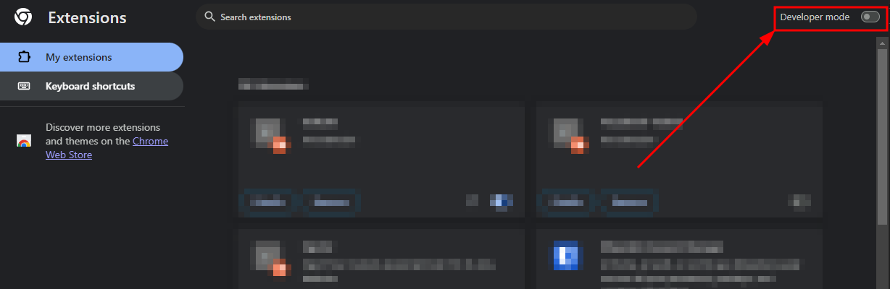
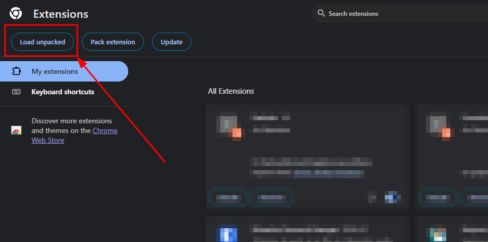
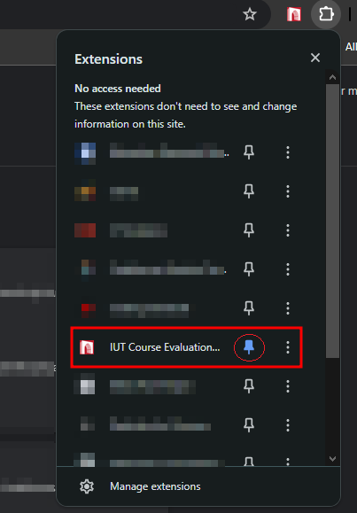
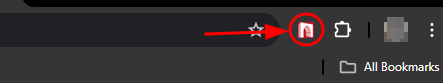
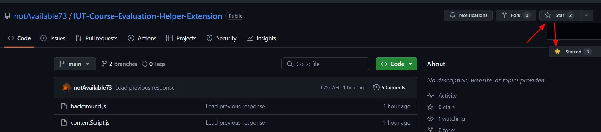

# IUT Course Evaluation Helper Extension

This browser extension is designed to help IUT students quickly complete their course evaluations each semester. It works on [IUT-SIS](https://sis.iutoic-dhaka.edu) across multiple browsers including Chrome, Firefox, Edge, and other Chromium-based browsers.

## Introduction

For **IUT students**, evaluating each course every semester involves answering around 36 questions: 9 are text boxes, and 27 are radio buttons where students rate from 1 to 5 stars. This process is very time-consuming, especially with 10 or more courses to evaluate.

This extension is created to save time. With one click, all questions will be filled with your provided values.

## Download and Installation Guide

### For Chrome, Edge, and other Chromium-based browsers:

1. **Download the Extension**

   - Click on [this link](https://github.com/notAvailable73/IUT-Course-Evaluation-Helper-Extension/archive/refs/heads/main.zip) to download the extension files.
   - Extract the downloaded file.

2. **Install the Extension**
   - Open your Chrome or Edge browser.
   - Go to the Extensions page by clicking on the three dots at the top right corner, then selecting `Extensions` > `Manage Extensions`.
   - Turn on **Developer mode**. You can find the switch at the top right of the Extensions page.
     - 
   - Click on the `Load unpacked` button.
     - 
   - Select the folder where you downloaded and extracted the extension files.
   - The extension will be installed, and you will see it in the list of extensions. Pin it to use it comfortably.
     - 

### For Firefox:

1. **Download the Extension**

   - Click on [this link](https://github.com/notAvailable73/IUT-Course-Evaluation-Helper-Extension/archive/refs/heads/main.zip) to download the extension files.
   - Extract the downloaded file.

2. **Install the Extension**

   - Open Firefox browser.
   - In the address bar, type `about:debugging#/runtime/this-firefox` and press Enter.
   - Click on `Load Temporary Add-on...`.
   - Navigate to the extracted folder and select the `manifest-firefox.json` file.
   - The extension will be loaded temporarily (it will be removed when Firefox is closed).

   > **Note:** Firefox uses Manifest V2, while Chrome uses Manifest V3. This is why we provide a separate manifest file for Firefox.

## How to Use the Extension

1. The extension icon will appear next to the address bar in your browser.
   - 
2. Go to [SIS-Evaluation](https://sis.iutoic-dhaka.edu/evaluation-list) to evaluate any course. Select any course that has not been evaluated.
3. If the page was already visited before installation, please reload the page.
4. Click on the extension icon next to the address bar.
5. In the popup interface:
   - Choose a rating value (1-5) for all radio button questions
   - Enter feedback text for all text fields
   - Click the "Fill Evaluation" button
6. All form fields on the evaluation page will be automatically filled with your chosen values.
7. You'll see a success notification when the process is complete.

## Features

- **Modern User Interface**: Clean and intuitive design
- **Cross-Browser Compatibility**: Works on Chrome, Firefox, Edge, and other Chromium-based browsers
- **Visual Feedback**: Shows success messages after form completion
- **Settings Persistence**: Remembers your last used rating and feedback

## Like the project?

- Don't forget us from your Du'a! 🤲
- If you like the project, please consider giving it a star ⭐️
  - 

## Troubleshooting

### General Issues:

- If you don't see the extension icon, make sure it's enabled in your browser's extension management page.
- If the extension doesn't work, try reloading the extension or reinstalling it.
- Ensure you're on the correct evaluation page (URL should contain "evaluate-course").

### Chrome/Edge Issues:

- If the extension doesn't load, try turning Developer mode off and on again, then reload the extension.
- Check the browser console (F12 > Console) for any error messages.

### Firefox Issues:

- Remember that temporary add-ons in Firefox are removed when the browser is closed.
- For Firefox, always use the `manifest-firefox.json` file when loading the extension.
- Firefox uses Manifest V2, while Chrome uses Manifest V3 for extensions.
- If you still encounter errors, try restarting Firefox after installation.

If problems persist, please open an issue on the GitHub repository with details about your browser version and the specific error you're encountering.
